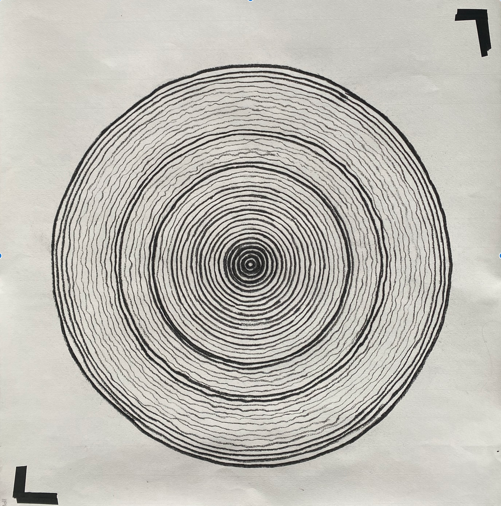

# Patterns of Democracy
Academic project part of the MA program in Visual Communication -> Information Design, during the summer semester of 2026 at the UdK Berlin. 

The project visualizes the complex and ever-changing nature of the political units of sovereign countries from 1900 to 2025.  Using AR, an interactive tool is created to help explain and understand the shifts between democracy and autocracy. 

The goal is to design a tool that helps political science researchers gain a better understanding of political changes, identify leaders, and predict future shifts. 

### About

In the framework of the collaboration between the UdK and the WZB Berlin Social Science Center, we joined the research team “Waves of Regime Transformation” led by Dr. Vanessa Boese-Schlosser.  The following visualisations are based on a tree-ring diagram, in which each ring represents the country's democratic score according to the ERT V-Dem dataset (see About the Data). Allowing us to trace patterns in regime transformation, showing the waves of democratisation and autocratisation spanning from 1900 to 2025, reading from center outwards.

### About the Data

Reading from the centre outwards, like tree rings, each diagram traces a country’s democratic history from 1900 to 2025. 
The thickness of each ring’s line reflects its Electoral Democracy Index <i>v2x_polyarchy</i>. Thick lines mark periods of autocracy, while thin lines mark periods of democracy. 
              
Whether the line is wavy or straight traces the Episodes of Regime Transformation identified by the ERT dataset <i>dem_ep</i> and <i> aut_ep</i>, each undulating line marking a sustained episode of democratisation or autocratisation, so that the overall pattern of the ring visualises the country’s trajectory of regime transformation over time. 

### About the Graphic 

Each ring’s value is calculated from the V-Dem Electoral Democracy Index <i>v2x_polyarchy</i>, which assigns every country a score between 0 and 1 for each year, where 0 denotes a closed autocracy and 1 denotes a full electoral democracy. 
This score is derived from five components: freedom of association, the fairness and integrity of elections, freedom of expression and the press, whether officeholders attained power through election, and the extent of suffrage. 
These five components are combined into a single value for each year, which is what each ring represents.

To capture sustained periods of change, we draw on the Episodes of Regime Transformation (ERT) dataset. Rather than reading the EDI year by year, the ERT dataset identifies distinct episodes of democratisation (liberalising autocracy, democratic deepening) and autocratisation (democratic regression, autocratic regression) within the V-Dem data, flagged through the <i>dem_ep</i> and <i>aut_ep</i> episode variables. 
It is this episodic view that allows each ring to speak not only to a single year’s value, but to the larger pattern of transformation it belongs to.  

### Development Journey: AR Technology Evolution

The project underwent several technological iterations before achieving the final interactive system:

1. **Blender (Initial Drafts)** - Started with 3D modeling and Motion Graphics in Blender, but this approach did not translate effectively to the AR environment, due to the composition on Geometry Node, It was not possible to be exported as an animation pon web readable format .glb
2. **ARjs** - At the same time as the Blender drwafts I attempted AR.js implementation, but encountered persistent jittering issues that compromised the visual experience
3. **Three.Js** - After abandoning the idea of Blender I choosed Three.JS due to the compatibility with web vizs. Smoother, lighter and overall better result than Blender. With limitation on materials and enviromental lightning. 
4. **MindAR** - Explored MindAR as an alternative, but continued to experience similar motion tracking problems, the jitter made me look for alternatives, wehere in online forums recommended the 8thWall use. 
5. **8th Wall + Three.js + A-Frame(Final Solution)** - Successfully implemented using 8th Wall with Three.js, creating a stable motion graphics interactive system that forms the foundation for the current experience.
8. **NGROK** - Use for the testing and debugging part of the project, that helped me to create a privat tunnel to my computer to adapt the AR model to the size
9. **OpenCode - Big Pickle** - As LLM for code helping. 

### Interactive Content Structure

Each episode features:
- **Collapsible Information Boxes** - Expandable text sections with contextual information
- **Integrated Imagery** - Images accompany text to provide visual context and enhance understanding
- **Interactive Graphics** - Motion graphics elements respond to user interaction, creating an engaging AR experience

## Try

### Preparing Target Images

Open with your phone the link on the 'About' section on this Git directory.
Give the permission to access to the phone camera. 
Scan the target :   
## We need to edit the pics to make them more clean this, maybe take out the glass? Rotate -90 degrees##
Touch on the boxes to get more info abour each time period. 
