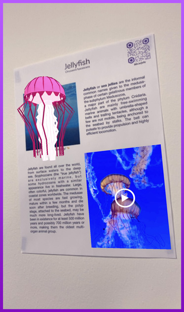
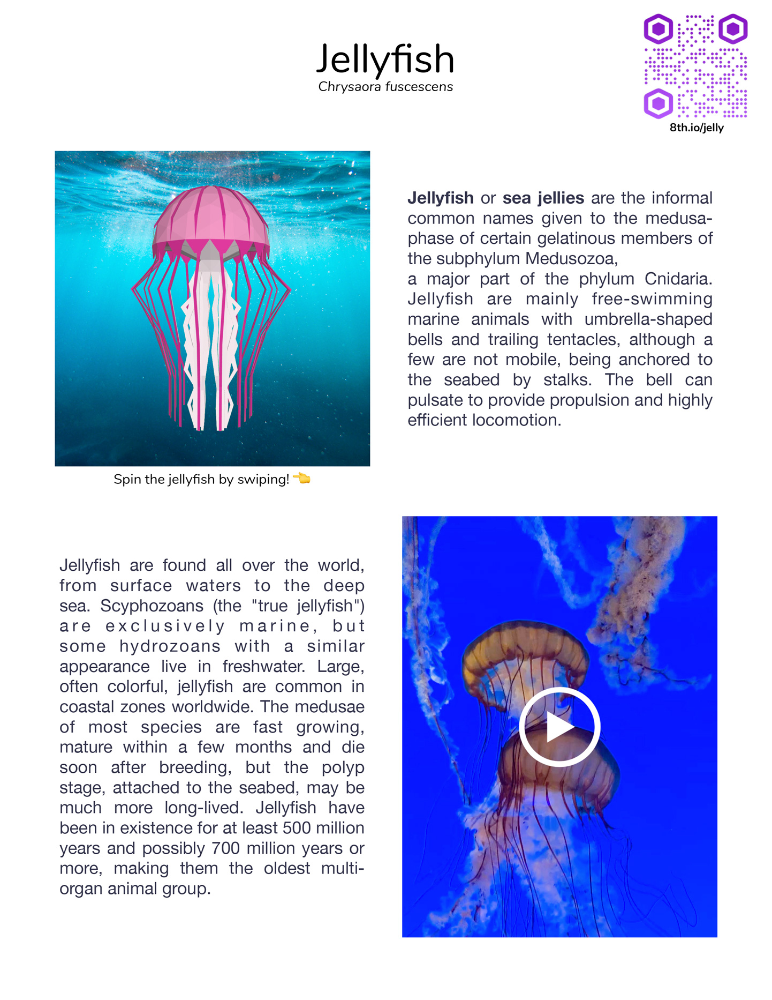

# A-Frame: Image Targets

This example uses image targets to display information about jellyfish on a flyer. It uses the xrextras-named-image-target component to connect an <a-entity> to an image target by name while the xr[...]



<details><summary>Try it out</summary>

https://8thwall.org/aframe-image-targets-example/




</details>

## About This Project

This AR project explores complex historical and contemporary imagery through augmented reality experiences. The work presents interactive visual narratives designed to be exhibited in Germany, with contextual information for international visitors.

### Target Image Selection

Two primary locations were selected as image targets:

- **Turkey** - Selected for its dramatic historical regime changes, which provide rich visual contrast and allow for better visualization of complex political transformations
- **Germany** - Selected as the primary exhibition location, with consideration for visitor context and accessibility. The content leverages popular historical knowledge (particularly regarding WWII) as an entry point for understanding broader historical complexities

### Development Journey: AR Technology Evolution

The project underwent several technological iterations before achieving the final interactive system:

1. **Blender (Initial Drafts)** - Started with 3D modeling and animation in Blender, but this approach did not translate effectively to the AR environment
2. **ARjs** - Attempted AR.js implementation, but encountered persistent jittering issues that compromised the visual experience
3. **MindAR** - Explored MindAR as an alternative, but continued to experience similar motion tracking problems
4. **8th Wall & Three.js (Final Solution)** - Successfully implemented using 8th Wall with Three.js, creating a stable motion graphics interactive system that forms the foundation for the current experience

### Interactive Content Structure

Each episode features:
- **Collapsible Information Boxes** - Expandable text sections with contextual information
- **Integrated Imagery** - Images accompany text to provide visual context and enhance understanding
- **Interactive Graphics** - Motion graphics elements respond to user interaction, creating an engaging AR experience

## Usage

1. On this repository, click **Code** > **Download ZIP**. If you clone the repository instead, make sure you have Git LFS installed and run `git lfs pull`
2. Unzip the folder to the location you'd like to work in
3. `npm install`
4. `npm run serve`
5. To connect to a mobile device, follow [these instructions](https://8th.io/test-on-mobile)
6. Recommended: Track your files using [git](https://git-scm.com/about) to avoid losing progress

### Preparing Target Images

Image targets can be generated using the interactive CLI tool: 

```bash
npx @8thwall/image-target-cli@latest
```

More information can be found here: https://github.com/8thwall/8thwall/blob/main/apps/image-target-cli/README.md

You can also use the [8th Wall Desktop app](https://8thwall.org/downloads) to generate image targets, then copy them into this project to use them in A-Frame.

## Deployment

This project contains Github Actions configuration for deployment to Github Pages, which triggers automatically by pushing the `main` branch. You can also create a production build using `npm run [...]

## Questions?

Please raise any questions on [Github Discussions](https://github.com/orgs/8thwall/discussions) or join the [Discord](https://8th.io/discord) to connect with the community.
